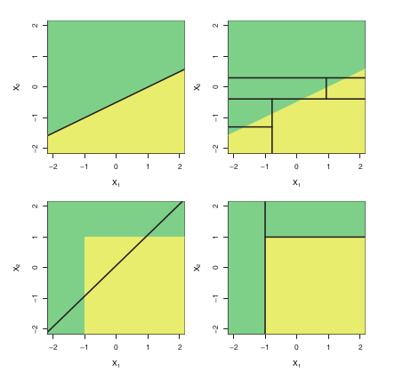

+++
title = "Understanding Gradient Boosting Machines"

date = 2020-03-09T21:00:00
draft = false

authors = ["Gabriel Teotonio"]

tags = ["Statistical learning", "Modelling", "gradient"]

summary = ""

# Projects (optional).
#   Associate this post with one or more of your projects.
#   Otherwise, set `projects = []`.

#projects = ["grants", "CEEMID"]

# Featured image
# To use, add an image named `featured.jpg/png` to your project's folder. 
[image]
# Caption (optional)
caption = ""

# Focal point (optional)
# Options: Smart, Center, TopLeft, Top, TopRight, Left, Right, BottomLeft, Bottom, BottomRight
focal_point = ""

# Show image only in page previews?
preview_only = false

+++
# Decision tree models 
Decision tree models are a good approach for leading to regression and classification problems when we have a scenario of non-linear relation between the variables, for example. A linear model will fail for capturing the true decision boundary, so the tree will outperform a linear model once it will splits the feature space with parallel lines to the axes. The following image took from the awesome book *_Introduction to Statistical Learning_* help us out to understand the aspects of decision trees.  

  

A lot of people love decision tree because is very simple to explain to others what is happening inside the model to get a possible outcome. The decision rule in each node is something very similar to what we could say taking a look on a 2D feature space. Even with a variety of advantages, decision trees models have some problems and possible ways to reduce them.   
The most popular problem is the fact that trees can be not robust. This means that small changes in the data can cause a large change in the final estimated tree. That is, we can achieve a big difference in performance when switch from the training to test data set.   
To leading with this problem, we have two methods that are seem as a boosting of a decision tree. In a few words, they are  

* Bagging (Bootstrap aggregation)  
Builds _B_ decision trees using _B_ different training datasets from a 

* Random Forest  

# Gradient Descent

# GBM 

### Simple workflow

### Math behind

# Comparing